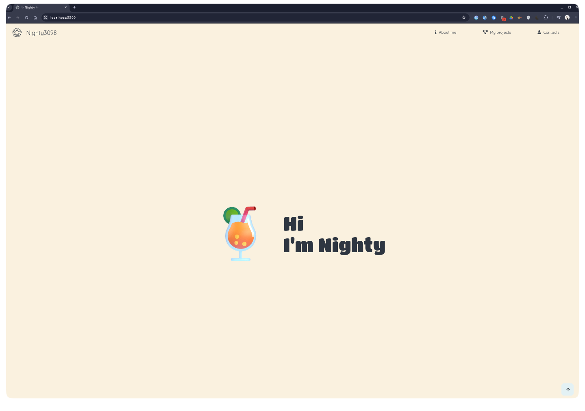
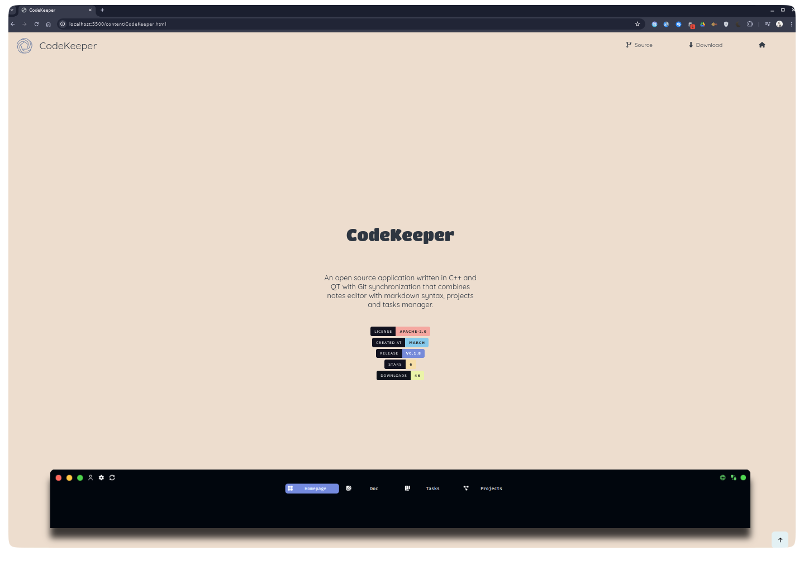

<h1 align="center">Nighty3098's portfolio</h1>

	
	  
	  
    
	
	
	
	
	
	
	  
    
    
    

  

    

  

    <h3>Imgs:</h3>
    
    

    <h3 align="center">Contact with me:</h3>
      
    
    
    
    

